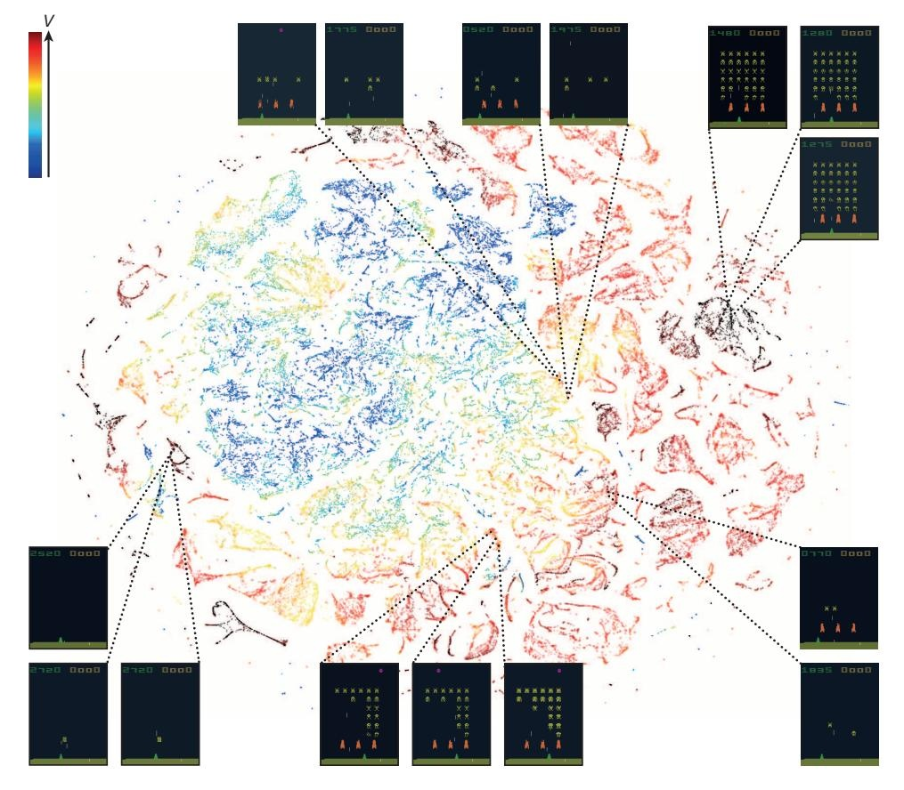

# Human-level control through deep reinforcement learning

Volodymyr Mnih1 \*, Koray Kavukcuoglu1 \*, David Silver1 \*, Andrei A. Rusu1 , Joel Veness1 , Marc G. Bellemare1 , Alex Graves1 , Martin Riedmiller1 , Andreas K. Fidjeland1 , Georg Ostrovski1 , Stig Petersen1 , Charles Beattie1 , Amir Sadik1 , Ioannis Antonoglou1 , Helen King1 , Dharshan Kumaran1 , Daan Wierstra1 , Shane Legg1 & Demis Hassabis1

The theory of reinforcement learning provides a normative account1 , deeply rooted in psychological2 and neuroscientific3 perspectives on animal behaviour, of how agents may optimize their control of an environment. To use reinforcementlearning successfullyin situations approaching real-world complexity, however, agents are confronted with a difficult task: they must derive efficient representations of the environment from high-dimensional sensory inputs, and use these to generalize past experience to new situations. Remarkably, humans and other animals seem to solve this problem through a harmonious combination of reinforcement learning and hierarchical sensory processing systems4,5, the former evidenced by a wealth of neural data revealing notable parallels between the phasic signals emitted by dopaminergic neurons and temporal difference reinforcement learning algorithms3 .While reinforcement learning agents have achieved some successesin a variety of domains6–8, their applicability has previously been limited to domainsin which useful features can be handcrafted, or to domains with fully observed, low-dimensional state spaces. Here we use recent advances in training deep neural networks9–11 to develop a novel artificial agent, termed a deep Q-network, that can learn successful policies directly from high-dimensional sensoryinputs using end-to-end reinforcement learning. We tested this agent on the challenging domain of classic Atari 2600 games12. We demonstrate that the deep Q-network agent, receiving only the pixels and the game score as inputs, was able to surpass the performance of all previous algorithms and achieve a level comparable to that of a professional human games tester across a set of 49 games, using the same algorithm, network architecture and hyperparameters. This work bridges the divide between high-dimensional sensory inputs and actions, resulting in the first artificial agent that is capable of learning to excel at a diverse array of challenging tasks.

We set out to create a single algorithm that would be able to develop a wide range of competencies on a varied range of challenging tasks—a central goal of general artificial intelligence13 that has eluded previous efforts8,14,15. To achieve this,we developed a novel agent, a deep Q-network (DQN), which is able to combine reinforcement learning with a class of artificial neural network16 known as deep neural networks. Notably, recent advances in deep neural networks9–11, in which several layers of nodes are used to build up progressively more abstract representations of the data, have made it possible for artificial neural networks to learn concepts such as object categories directly from raw sensory data. We use one particularly successful architecture, the deep convolutional network17, which uses hierarchical layers of tiled convolutional filters to mimic the effects of receptive fields—inspired by Hubel andWiesel's seminalwork onfeedforward processingin early visual cortex18—thereby exploiting the local spatial correlations present in images, and building in robustness to natural transformations such as changes of viewpoint or scale.

We consider tasks in which the agent interacts with an environment through a sequence of observations, actions and rewards. The goal of the agent is to select actions in a fashion that maximizes cumulative future

$$
Q^*(s,a) = \max_{\pi} \mathbb{E}[r_t + \gamma r_{t+1} + \gamma^2 r_{t+2} + \dots | s_t = s, a_t = a, \pi],
$$

reward. More formally, we use a deep convolutional neural network to

approximate the optimal action-value function

which is the maximum sum of rewardsrt discounted by c at each timestep t, achievable by a behaviour policy p 5 P(ajs), after making an observation (s) and taking an action (a) (see Methods)19.

Reinforcement learning is known to be unstable or even to diverge when a nonlinear function approximator such as a neural network is used to represent the action-value (also known as Q) function20. This instability has several causes: the correlations present in the sequence of observations, thefact that small updates toQ may significantly change the policy and therefore change the data distribution, and the correlations between the action-values (Q) and the target valuesrzc max a0 Q s 0 , a0 ð Þ. We address these instabilities with a novel variant of Q-learning, which uses two key ideas. First, we used a biologically inspired mechanism termed experience replay21–23 that randomizes over the data, thereby removing correlations in the observation sequence and smoothing over changes in the data distribution (see below for details). Second, we used an iterative update that adjusts the action-values (Q) towards target values that are only periodically updated, thereby reducing correlations with the target.

While other stable methods exist for training neural networks in the reinforcement learning setting, such as neural fitted Q-iteration24, these methods involve the repeated training of networks de novo on hundreds of iterations. Consequently, these methods, unlike our algorithm, are too inefficient to be used successfully with large neural networks. We parameterize an approximate value function Q(s,a;hi) using the deep convolutional neural network shown in Fig. 1,in which hi are the parameters (that is, weights) of the Q-network at iteration i. To perform experience replay we store the agent's experiences et5 (st,at,rt,st 1 1) at each time-step t in a data set Dt 5 {e1,…,et}. During learning, we apply Q-learning updates, on samples (or minibatches) of experience (s,a,r,s9) , U(D), drawn uniformly at random from the pool of stored samples. The Q-learning update at iteration i uses the following loss function:

$$
L_i(\theta_i) = \mathbb{E}_{(s,a,r,s') \sim U(D)} \left[ \left( r + \gamma \max_{a'} Q(s',a'; \theta_i^-) - Q(s,a; \theta_i) \right)^2 \right]
$$

in which c is the discount factor determining the agent's horizon, hi are the parameters of the Q-network at iteration i and h{ i are the network parameters used to compute the target at iteration i. The target network parameters h{ i are only updated with the Q-network parameters (hi) every C steps and are held fixed between individual updates (see Methods).

To evaluate our DQN agent, we took advantage of the Atari 2600 platform, which offers a diverse array of tasks (n 5 49) designed to be

Google DeepMind, 5 New Street Square, London EC4A 3TW, UK.

\*These authors contributed equally to this work.

Figure 1 | Schematic illustration of the convolutional neural network. The details of the architecture are explained in the Methods. The input to the neural network consists of an 84 3 84 3 4 image produced by the preprocessing map w, followed by three convolutional layers (note: snaking blue line

difficult and engaging for human players. We used the same network architecture, hyperparameter values (see Extended Data Table 1) and learning procedure throughout—taking high-dimensional data (210|160 colour video at 60 Hz) as input—to demonstrate that our approach robustly learns successful policies over a variety of games based solely on sensoryinputswith only veryminimal prior knowledge (thatis,merely the input data were visual images, and the number of actions available in each game, but not their correspondences; see Methods). Notably, our method was able to train large neural networks using a reinforcement learning signal and stochastic gradient descent in a stablemanner illustrated by the temporal evolution of two indices of learning (the agent's average score-per-episode and average predicted Q-values; see Fig. 2 and Supplementary Discussion for details).

symbolizes sliding of each filter across input image) and two fully connected layers with a single output for each valid action. Each hidden layer is followed by a rectifier nonlinearity (that is, max 0ð Þ ,x ).

We compared DQN with the best performing methods from the reinforcement learning literature on the 49 games where results were available12,15. In addition to the learned agents, we also report scores for a professional human games tester playing under controlled conditions and a policy that selects actions uniformly at random (Extended Data Table 2 and Fig. 3, denoted by 100% (human) and 0% (random) on y axis; see Methods). Our DQN method outperforms the best existing reinforcement learning methods on 43 of the games without incorporating any of the additional prior knowledge about Atari 2600 games used by other approaches (for example, refs 12, 15). Furthermore, our DQN agent performed at a level that was comparable to that of a professional human games tester across the set of 49 games, achieving more than 75% of the human score on more than half of the games (29 games;

Figure 2 | Training curves tracking the agent's average score and average predicted action-value. a, Each point is the average score achieved per episode after the agent is run with e-greedy policy (e 5 0.05) for 520 k frames on Space Invaders. b, Average score achieved per episode for Seaquest. c, Average predicted action-value on a held-out set of states on Space Invaders. Each point

on the curve is the average of the action-value Q computed over the held-out set of states. Note that Q-values are scaled due to clipping of rewards (see Methods). d, Average predicted action-value on Seaquest. See Supplementary Discussion for details.

# LETTER RESEARCH

Figure 3 | Comparison of the DQN agent with the best reinforcement learning methods15 in the literature. The performance of DQN is normalized with respect to a professional human games tester (that is, 100% level) and random play (that is, 0% level). Note that the normalized performance of DQN, expressed as a percentage, is calculated as: 100 3 (DQN score 2 random play score)/(human score 2 random play score). It can be seen that DQN

outperforms competing methods (also see Extended Data Table 2) in almost all the games, and performs at a level that is broadly comparable with or superior to a professional human games tester (that is, operationalized as a level of 75% or above) in the majority of games. Audio output was disabled for both human players and agents. Error bars indicate s.d. across the 30 evaluation episodes, starting with different initial conditions.

see Fig. 3, Supplementary Discussion and Extended Data Table 2). In additional simulations (see Supplementary Discussion and Extended Data Tables 3 and 4), we demonstrate the importance of the individual core components of the DQN agent—the replay memory, separate target Q-network and deep convolutional network architecture—by disabling them and demonstrating the detrimental effects on performance.

We next examined the representations learned by DQN that underpinned the successful performance of the agent in the context of the game Space Invaders (see Supplementary Video 1 for a demonstration of the performance of DQN), by using a technique developed for the visualization of high-dimensional data called 't-SNE'25 (Fig. 4). As expected, the t-SNE algorithm tends to map the DQN representation of perceptually similar states to nearby points. Interestingly,we alsofoundinstances in which the t-SNE algorithm generated similar embeddings for DQN representations of states that are close in terms of expected reward but perceptually dissimilar (Fig. 4, bottom right, top left and middle), consistent with the notion that the network is able to learn representations that support adaptive behaviourfrom high-dimensional sensory inputs. Furthermore, we also show that the representations learned by DQN are able to generalize to data generated from policies other than its own—in simulations where we presented as input to the network game states experienced during human and agent play, recorded the representations of the last hidden layer, and visualized the embeddings generated by the t-SNE algorithm (Extended Data Fig. 1 and Supplementary Discussion). Extended Data Fig. 2 provides an additional illustration of how the representations learned by DQN allow it to accurately predict state and action values.

It is worth noting that the games in which DQN excels are extremely varied in their nature, from side-scrolling shooters (River Raid) to boxing games (Boxing) and three-dimensional car-racing games (Enduro).

Figure 4 | Two-dimensional t-SNE embedding of the representations in the last hidden layer assigned by DQN to game states experienced while playing Space Invaders. The plot was generated by letting the DQN agent play for 2 h of real game time and running the t-SNE algorithm25 on the last hidden layer representations assigned by DQN to each experienced game state. The points are coloured according to the state values (V, maximum expected reward of a state) predicted by DQN for the corresponding game states (ranging from dark red (highest V) to dark blue (lowest V)). The screenshots corresponding to a selected number of points are shown. The DQN agent

Indeed, in certain games DQN is able to discover a relatively long-term strategy (for example, Breakout: the agent learns the optimal strategy, which is to first dig a tunnel around the side of the wall allowing the ball to be sent around the back to destroy a large number of blocks; see Supplementary Video 2 for illustration of development of DQN's performance over the course of training). Nevertheless, games demandingmore temporally extended planning strategies still constitute a major challengefor all existing agents including DQN (for example,Montezuma's Revenge).

In this work, we demonstrate that a single architecture can successfully learn control policies in a range of different environments with only very minimal prior knowledge, receiving only the pixels and the game score as inputs, and using the same algorithm, network architecture and hyperparameters on each game, privy only to the inputs a human player would have. In contrast to previous work24,26, our approach incorporates 'end-to-end' reinforcement learning that uses reward to continuously shape representations within the convolutional network towards salient features of the environment that facilitate value estimation. This principle draws on neurobiological evidence that reward signals during perceptual learning may influence the characteristics of representations within primate visual cortex27,28. Notably, the successful integration of reinforcement learning with deep network architectures was critically dependent on our incorporation of a replay algorithm21–23 involving the storage and representation of recently experienced transitions. Convergent evidence suggests that the hippocampus may support the physical predicts high state values for both full (top right screenshots) and nearly complete screens (bottom left screenshots) because it has learned that completing a screen leads to a new screen full of enemy ships. Partially completed screens (bottom screenshots) are assigned lower state values because less immediate reward is available. The screens shown on the bottom right and top left and middle are less perceptually similar than the other examples but are still mapped to nearby representations and similar values because the orange bunkers do not carry great significance near the end of a level. With permission from Square Enix Limited.

realization of such a process in the mammalian brain, with the timecompressed reactivation of recently experienced trajectories during offline periods21,22 (for example, waking rest) providing a putative mechanism by which value functions may be efficiently updated through interactions with the basal ganglia22. In the future, it will be important to explore the potential use of biasing the content of experience replay towards salient events, a phenomenon that characterizes empirically observed hippocampal replay29, and relates to the notion of 'prioritized sweeping'30 in reinforcement learning. Taken together, our work illustrates the power of harnessing state-of-the-art machine learning techniques with biologically inspired mechanisms to create agents that are capable of learning to master a diverse array of challenging tasks.

Online Content Methods, along with any additional Extended Data display items and Source Data, are available in the [online version of the paper](www.nature.com/doifinder/10.1038/nature14236); references unique to these sections appear only in the online paper.

#### Received 10 July 2014; accepted 16 January 2015.

- 1. Sutton, R. & Barto, A. Reinforcement Learning: An Introduction (MIT Press, 1998).
- 2. Thorndike, E. L. Animal Intelligence: Experimental studies (Macmillan, 1911).
- 3. Schultz, W., Dayan, P. & Montague, P. R. A neural substrate of prediction and reward. Science 275, 1593–1599 (1997).
- 4. Serre, T., Wolf, L. & Poggio, T. Object recognition with features inspired by visual cortex. Proc. IEEE. Comput. Soc. Conf. Comput. Vis. Pattern. Recognit. 994–1000 (2005).
- 5. Fukushima, K. Neocognitron: A self-organizing neural network model for a mechanism of pattern recognition unaffected by shift in position. Biol. Cybern. 36, 193–202 (1980).

LETTER RESEARCH

- 6. Tesauro, G. Temporal difference learning and TD-Gammon. Commun. ACM 38, 58–68 (1995).
- 7. Riedmiller, M., Gabel, T., Hafner, R. & Lange, S. Reinforcement learning for robot soccer. Auton. Robots 27, 55–73 (2009).
- 8. Diuk, C., Cohen, A. & Littman, M. L. An object-oriented representation for efficient reinforcement learning. Proc. Int. Conf. Mach. Learn. 240–247 (2008).
- 9. Bengio, Y. Learning deep architectures for AI. Foundations and Trends in Machine Learning 2, 1–127 (2009).
- 10. Krizhevsky, A., Sutskever, I. & Hinton, G. ImageNet classification with deep
- convolutional neural networks. Adv. Neural Inf. Process. Syst.25, 1106–1114 (2012). 11. Hinton, G. E. & Salakhutdinov, R. R. Reducing the dimensionality of data with
- neural networks. Science 313, 504–507 (2006). 12. Bellemare, M. G., Naddaf, Y., Veness, J. & Bowling, M. The arcade learning environment: An evaluation platform for general agents. J. Artif. Intell. Res. 47, 253–279 (2013).
- 13. Legg, S. & Hutter, M. Universal Intelligence: a definition of machine intelligence. Minds Mach. 17, 391–444 (2007).
- 14. Genesereth, M., Love, N. & Pell, B. General game playing: overview of the AAAI competition. AI Mag. 26, 62–72 (2005).
- 15. Bellemare, M. G., Veness, J. & Bowling, M. Investigating contingency awareness using Atari 2600 games. Proc. Conf. AAAI. Artif. Intell. 864–871 (2012).
- 16. McClelland, J. L., Rumelhart, D. E. & Group, T. P. R. Parallel Distributed Processing: Explorations in the Microstructure of Cognition (MIT Press, 1986).
- 17. LeCun, Y., Bottou, L., Bengio, Y. & Haffner, P. Gradient-based learning applied to document recognition. Proc. IEEE 86, 2278–2324 (1998).
- 18. Hubel, D. H. & Wiesel, T. N. Shape and arrangement of columns in cat's striate cortex. J. Physiol. 165, 559–568 (1963).
- 19. Watkins, C. J. & Dayan, P. Q-learning. Mach. Learn. 8, 279–292 (1992). 20. Tsitsiklis, J. & Roy, B. V. An analysis of temporal-difference learning with function
- approximation. IEEE Trans. Automat. Contr. 42, 674–690 (1997). 21. McClelland, J. L., McNaughton, B. L. & O'Reilly, R. C. Why there are complementary
- learning systems in the hippocampus and neocortex: insights from the successes and failures of connectionist models of learning and memory. Psychol. Rev. 102, 419–457 (1995).
- 22. O'Neill, J., Pleydell-Bouverie, B., Dupret, D. & Csicsvari, J. Play it again: reactivation of waking experience and memory. Trends Neurosci. 33, 220–229 (2010).
- 23. Lin, L.-J. Reinforcement learning for robots using neural networks. Technical Report, DTIC Document (1993).
- 24. Riedmiller, M. Neural fitted Q iteration first experiences with a data efficient neural reinforcement learning method. Mach. Learn.: ECML, 3720, 317–328 (Springer, 2005).
- 25. Van der Maaten, L. J. P. & Hinton, G. E. Visualizing high-dimensional data using t-SNE. J. Mach. Learn. Res. 9, 2579–2605 (2008).
- 26. Lange, S. & Riedmiller, M. Deep auto-encoder neural networks in reinforcement learning. Proc. Int. Jt. Conf. Neural. Netw. 1–8 (2010).
- 27. Law, C.-T. & Gold, J. I. Reinforcement learning can account for associative and perceptual learning on a visual decision task. Nature Neurosci. 12, 655 (2009).
- 28. Sigala, N. & Logothetis, N. K. Visual categorization shapes feature selectivity in the primate temporal cortex. Nature 415, 318–320 (2002).
- 29. Bendor, D. & Wilson, M. A. Biasing the content of hippocampal replay during sleep. Nature Neurosci. 15, 1439–1444 (2012).
- 30. Moore, A. & Atkeson, C. Prioritized sweeping: reinforcement learning with less data and less real time. Mach. Learn. 13, 103–130 (1993).

Supplementary Information is available in the [online version of the paper](www.nature.com/doifinder/10.1038/nature14236).

Acknowledgements We thank G. Hinton, P. Dayan and M. Bowling for discussions, A. Cain and J. Keene for work on the visuals, K. Keller and P. Rogers for help with the visuals, G. Wayne for comments on an earlier version of the manuscript, and the rest of the DeepMind team for their support, ideas and encouragement.

Author Contributions V.M., K.K., D.S., J.V., M.G.B., M.R., A.G., D.W., S.L. and D.H. conceptualized the problem and the technical framework. V.M., K.K., A.A.R. and D.S. developed and tested the algorithms. J.V., S.P., C.B., A.A.R., M.G.B., I.A., A.K.F., G.O. and A.S. created the testing platform. K.K., H.K., S.L. and D.H. managed the project. K.K., D.K., D.H., V.M., D.S., A.G., A.A.R., J.V. and M.G.B. wrote the paper.

Author Information Reprints and permissions information is available at [www.nature.com/reprints.](www.nature.com/reprints) The authors declare no competing financial interests. Readers are welcome to comment on the [online version of the paper](www.nature.com/doifinder/10.1038/nature14236). Correspondence and requests for materials should be addressed to K.K. [\(korayk@google.com\)](mailto:korayk@google.com) or D.H. [\(demishassabis@google.com\).](mailto:demishassabis@google.com)

# METHODS

Preprocessing. Working directly with raw Atari 2600 frames, which are 2103 160 pixel images with a 128-colour palette, can be demanding in terms of computation and memory requirements.We apply a basic preprocessing step aimed at reducing the input dimensionality and dealing with some artefacts of the Atari 2600 emulator. First, to encode a singleframe we take themaximum valuefor each pixel colour value over the frame being encoded and the previous frame. This was necessary to remove flickering that is present in games where some objects appear only in even frames while other objects appear only in odd frames, an artefact caused by the limited number of sprites Atari 2600 can display at once. Second, we then extract the Y channel, also known as luminance, from the RGB frame and rescale it to 84 3 84. The function w from algorithm 1 described below applies this preprocessing to the m most recent frames and stacks them to produce the input to the Q-function, in whichm 5 4, although the algorithm is robust to different values of m (for example, 3 or 5).

Code availability. The source code can be accessed at [https://sites.google.com/a/](https://sites.google.com/a/deepmind.com/dqn) [deepmind.com/dqn](https://sites.google.com/a/deepmind.com/dqn) for non-commercial uses only.

Model architecture. There are several possible ways of parameterizing Q using a neural network. Because Q maps history–action pairs to scalar estimates of their Q-value, the history and the action have been used as inputs to the neural network by some previous approaches24,26. The main drawback of this type of architecture is that a separate forward pass is required to compute the Q-value of each action, resulting in a cost that scales linearly with the number of actions.We instead use an architecture in which there is a separate output unit for each possible action, and only the state representation is an input to the neural network. The outputs correspond to the predicted Q-values of the individual actions for the input state. The main advantage of this type of architecture is the ability to compute Q-valuesfor all possible actions in a given state with only a single forward pass through the network.

The exact architecture, shown schematically in Fig. 1, is as follows. The input to the neural network consists of an 843 843 4 image produced by the preprocessing map w. The first hidden layer convolves 32 filters of 8 3 8 with stride 4 with the input image and applies a rectifier nonlinearity31,32. The second hidden layer convolves 64 filters of 4 3 4 with stride 2, again followed by a rectifier nonlinearity. This isfollowed by a third convolutional layer that convolves 64filters of 3 3 3 with stride 1 followed by a rectifier. The final hidden layer is fully-connected and consists of 512 rectifier units. The output layer is a fully-connected linear layer with a single output for each valid action. The number of valid actions varied between 4 and 18 on the games we considered.

Training details.We performed experiments on 49Atari 2600 games where results were available for all other comparable methods12,15. A different network was trained on each game: the same network architecture, learning algorithm and hyperparameter settings (see Extended Data Table 1) were used across all games, showing that our approach is robust enough to work on a variety of games while incorporating onlyminimal prior knowledge (see below).Whilewe evaluated our agents on unmodified games, we made one change to the reward structure of the games during training only. As the scale of scores varies greatly from game to game, we clipped all positive rewards at 1 and all negative rewards at 21, leaving 0 rewards unchanged. Clipping the rewards in this manner limits the scale of the error derivatives and makes it easier to use the same learning rate across multiple games. At the same time, it could affect the performance of our agent since it cannot differentiate between rewards of different magnitude. For games where there is a life counter, the Atari 2600 emulator also sends the number of lives left in the game, which is then used to mark the end of an episode during training.

In these experiments, we used the RMSProp (see [http://www.cs.toronto.edu/](http://www.cs.toronto.edu/~tijmen/csc321/slides/lecture_slides_lec6.pdf) ,[tijmen/csc321/slides/lecture\\_slides\\_lec6.pdf](http://www.cs.toronto.edu/~tijmen/csc321/slides/lecture_slides_lec6.pdf) ) algorithm with minibatches of size 32. The behaviour policy during training was e-greedy with e annealed linearly from 1.0 to 0.1 over the first million frames, and fixed at 0.1 thereafter. We trained for a total of 50 million frames (that is, around 38 days of game experience in total) and used a replay memory of 1 million most recent frames.

Following previous approaches to playing Atari 2600 games, we also use a simple frame-skipping technique15. More precisely, the agent sees and selects actions on every kth frame instead of every frame, and its last action is repeated on skipped frames. Because running the emulator forward for one step requires much less computation than having the agent select an action, this technique allows the agent to play roughly k times more games without significantly increasing the runtime. We use k 5 4 for all games.

The values of all the hyperparameters and optimization parameters were selected by performing an informal search on the games Pong, Breakout, Seaquest, Space Invaders and Beam Rider. We did not perform a systematic grid search owing to the high computational cost. These parameters were then held fixed across all other games. The values and descriptions of all hyperparameters are provided in Extended Data Table 1.

Our experimental setup amounts to using the following minimal prior knowledge: that the input data consisted of visual images (motivating our use of a convolutional deep network), the game-specific score (with no modification), number of actions, although not their correspondences (for example, specification of the up 'button') and the life count.

Evaluation procedure. The trained agents were evaluated by playing each game 30 times for up to 5 min each time with different initial random conditions ('noop'; see Extended Data Table 1) and an e-greedy policy with e 5 0.05. This procedure is adopted to minimize the possibility of overfitting during evaluation. The random agent served as a baseline comparison and chose a random action at 10 Hz which is every sixth frame, repeating its last action on intervening frames. 10 Hz is about the fastest that a human player can select the 'fire' button, and setting the random agent to this frequency avoids spurious baseline scores in a handful of the games.We did also assess the performance of a random agent that selected an action at 60 Hz (that is, every frame). This had a minimal effect: changing the normalized DQN performance by more than 5% in only six games (Boxing, Breakout, Crazy Climber, Demon Attack, Krull and Robotank), and in all these games DQN outperformed the expert human by a considerable margin.

The professional human tester used the same emulator engine as the agents, and played under controlled conditions. The human tester was not allowed to pause, save or reload games. As in the original Atari 2600 environment, the emulator was run at 60 Hz and the audio output was disabled: as such, the sensory input was equated between human player and agents. The human performance is the average reward achievedfrom around 20 episodes of each game lasting a maximum of 5 min each, following around 2 h of practice playing each game.

Algorithm. We consider tasks in which an agent interacts with an environment, in this case the Atari emulator, in a sequence of actions, observations and rewards. At each time-step the agent selects an action at from the set of legal game actions, A~f g 1, ... ,K . The action is passed to the emulator and modifies its internal state and the game score. In general the environment may be stochastic. The emulator's internal state is not observed by the agent; instead the agent observes an image xt[Rd from the emulator, which is a vector of pixel values representing the current screen. In addition it receives a reward rt representing the change in game score. Note that in general the game score may depend on the whole previous sequence of actions and observations;feedback about an action may only be received after many thousands of time-steps have elapsed.

Because the agent only observes the current screen, the task is partially observed33 and many emulator states are perceptually aliased (that is, it is impossible to fully understand the current situation from only the current screen xt). Therefore, sequences of actions and observations, st~x1,a1,x2,:::,at{1,xt, are input to the algorithm, which then learns game strategies depending upon these sequences. All sequences in the emulator are assumed to terminate in a finite number of timesteps. Thisformalism gives rise to a large but finiteMarkov decision process (MDP) in which each sequence is a distinct state. As a result, we can apply standard reinforcement learning methods for MDPs, simply by using the complete sequence st as the state representation at time t.

The goal of the agent is to interact with the emulator by selecting actions in a way that maximizesfuture rewards.We make the standard assumption that future rewards are discounted by a factor of c per time-step (c was set to 0.99 throughout), and define the future discounted return at time t as Rt~XT t0~t ct 0 {t rt0 , in which T is the time-step at which the game terminates. We define the optimal action-value function Qð Þ s,a as the maximum expected return achievable by following any policy, after seeing some sequence s and then taking some action a, Qð Þ s,a ~ maxp Rt ½ Dst~s,at~a,p in which p is a policy mapping sequences to actions (or distributions over actions).

The optimal action-value function obeys an important identity known as the Bellman equation. This is based on the following intuition: if the optimal value Q s 0 ,a0 ð Þ of the sequence s9 at the next time-step was known for all possible actions a9, then the optimal strategy is to select the action a9 maximizing the expected value of rzcQ s 0 ,a0 ð Þ:

$$
Q^*(s,a) = \mathbb{E}_{s'} \left[ r + \gamma \max_{a'} Q^*(s',a') | s,a \right]
$$

The basic idea behind many reinforcement learning algorithms is to estimate the action-value function by using the Bellman equation as an iterative update, Qiz1ð Þ s,a ~ s0 rzc maxa0 Qi s 0 ,a0 ½ ð ÞDs,a . Such value iteration algorithms converge to the optimal action-valuefunction,Qi?Q asi??. In practice, this basic approach is impractical, because the action-value function is estimated separately for each sequence, without any generalization. Instead, it is common to use afunction approximator to estimate the action-value function, Qð Þ s,a; h <Qð Þ s,a . In the reinforcement learning community this is typically a linear function approximator, but sometimes a nonlinear function approximator is used instead, such as a neural network. We refer to a neural network function approximator with weights h as a Q-network. A Q-network can be trained by adjusting the parameters hi at iteration i to reduce the mean-squared error in the Bellman equation, where the optimal target values rzc maxa0 Q s 0 ,a0 ð Þ are substituted with approximate target values y~rzc maxa0 Q s 0 ,a0 ; h{ i , using parameters h{ i from some previous iteration. This leads to a sequence of loss functions Li(hi) that changes at each iteration i,

$$
L_i(\theta_i) = \mathbb{E}_{s,a,r} \left[ \left( \mathbb{E}_{s'}[y|s,a] - Q(s,a;\theta_i) \right)^2 \right]
$$
  
=  $\mathbb{E}_{s,a,r,s'} \left[ \left( y - Q(s,a;\theta_i) \right)^2 \right] + \mathbb{E}_{s,a,r} [\mathbb{V}_{s'}[y]].$ 

Note that the targets depend on the network weights; this is in contrast with the targets used for supervised learning, which are fixed before learning begins. At each stage of optimization, we hold the parameters from the previous iteration hi 2 fixed when optimizing the ith loss function Li(hi), resulting in a sequence of welldefined optimization problems. The final term is the variance of the targets, which does not depend on the parameters hi that we are currently optimizing, and may therefore be ignored. Differentiating the loss function with respect to the weights we arrive at the following gradient:

$$
\nabla_{\theta_i} L(\theta_i) = \mathbb{E}_{s,a,r,s'} \left[ \left( r + \gamma \max_{a'} Q(s',a';\theta_i^-) - Q(s,a;\theta_i) \right) \nabla_{\theta_i} Q(s,a;\theta_i) \right].
$$

Rather than computing the full expectations in the above gradient, it is often computationally expedient to optimize the loss function by stochastic gradient descent. The familiar Q-learning algorithm19 can be recovered in this framework by updating the weights after every time step, replacing the expectations using single samples, and setting h{ i ~hi{1.

Note that this algorithm is model-free: it solves the reinforcement learning task directly using samples from the emulator, without explicitly estimating the reward and transition dynamics P r,s 0 ð Þ Ds,a . It is also off-policy: it learns about the greedy policy a~argmaxa0Q s,a0 ð Þ ; h , while following a behaviour distribution that ensures adequate exploration of the state space. In practice, the behaviour distribution is often selected by an e-greedy policy that follows the greedy policy with probability 1 2 e and selects a random action with probability e.

Training algorithm for deep Q-networks. The full algorithm for training deep Q-networks is presented in Algorithm 1. The agent selects and executes actions according to an e-greedy policy based on Q. Because using histories of arbitrary length as inputs to a neural network can be difficult, our Q-function instead works on a fixed length representation of histories produced by the function w described above. The algorithm modifies standard online Q-learning in two ways to make it suitable for training large neural networks without diverging.

First, we use a technique known as experience replay23 in which we store the agent's experiences at each time-step,et5 (st, at,rt,st 1 1), in a data setDt5 {e1,…,et}, pooled over many episodes (where the end of an episode occurs when a terminal state is reached) into a replay memory. During the inner loop of the algorithm, we apply Q-learning updates, or minibatch updates, to samples of experience, (s, a,r,s9) , U(D), drawn at random from the pool of stored samples. This approach has several advantages over standard online Q-learning. First, each step of experience is potentially used in many weight updates, which allowsfor greater data efficiency. Second, learning directly from consecutive samples is inefficient, owing to the strong correlations between the samples; randomizing the samples breaks these correlations and therefore reduces the variance of the updates. Third, when learning onpolicy the current parameters determine the next data sample that the parameters are trained on. For example, if the maximizing action is to move left then the training samples will be dominated by samples from the left-hand side; if the maximizing action then switches to the right then the training distribution will also switch. Itis easy to see how unwanted feedback loops may arise and the parameters could get stuckin a poor localminimum, or even diverge catastrophically20. By using experience replay the behaviour distribution is averaged over many of its previous states, smoothing out learning and avoiding oscillations or divergence in the parameters. Note that when learning by experience replay, it is necessary to learn off-policy (because our current parameters are different to those used to generate the sample), which motivates the choice of Q-learning.

In practice, our algorithm only stores the last N experience tuples in the replay memory, and samples uniformly at random from Dwhen performing updates. This approach is in some respects limited because the memory buffer does not differentiate important transitions and always overwrites with recent transitions owing to the finite memory size N. Similarly, the uniform sampling gives equal importance to all transitions in the replay memory. A more sophisticated sampling strategy might emphasize transitions from which we can learn the most, similar to prioritized sweeping30.

The second modification to online Q-learning aimed at further improving the stability of our method with neural networks is to use a separate network for generating the targets yj in the Q-learning update. More precisely, every C updates we clone the network Q to obtain a target network Q^ and use Q^ for generating the Q-learning targets yj for the followingC updates to Q. This modification makes the algorithm more stable compared to standard online Q-learning, where an update that increasesQ(st,at) often also increasesQ(st 1 1,a)for all a and hence also increases the target yj, possibly leading to oscillations or divergence of the policy. Generating the targets using an older set of parameters adds a delay between the time an update to Q is made and the time the update affects the targets yj , making divergence or oscillations much more unlikely.

We also found it helpful to clip the error term from the update rzc maxa0 Q s 0 ,a0 ; h{ i {Qð Þ s,a; hi to be between 21 and 1. Because the absolute value loss function jxj has a derivative of 21 for all negative values of x and a derivative of 1 for all positive values of x, clipping the squared error to be between 21 and 1 corresponds to using an absolute value loss function for errors outside of the (21,1) interval. This form of error clipping further improved the stability of the algorithm. Algorithm 1: deep Q-learning with experience replay.

Initialize replay memory D to capacity N

Initialize action-value function Q with random weights h Initialize target action-value function Q^ with weights h2 5 h

#### For episode 5 1, M do

Initialize sequence s1~f g x1 and preprocessed sequence w1~wð Þ s1 For t 5 1,T do

With probability e select a random action at otherwise select at~argmaxaQ wð Þ st ð Þ ,a; h Execute action at in emulator and observe reward rt and image xt 1 1

Set 
$$
s_{t+1} = s_t, a_t, x_{t+1}
$$
 and preprocess  $\phi_{t+1} = \phi(s_{t+1})$ 

Store transition wt,at,rt,wtz1 in D

Store transformation 
$$
(\varphi_t, a_t, r_t, \varphi_{t+1})
$$
 in *D*  
Sample random minibatch of transitions  $(\varphi_j, a_j, r_j, \varphi_{j+1})$  from *D*

Set 
$$
y_j = \begin{cases} r_j & \text{if episode terminates at step } j+1 \\ r_j + \gamma \max_{a'} \hat{Q}(\phi_{j+1}, a'; \theta^{-}) & \text{otherwise} \end{cases}
$$

rjzc maxa0 Q^ wjz1,a0 Perform a gradient descent step on yj{Q wj,aj; h 2

with respect to the network parameters h

Every C steps reset Q^~Q

#### End For End For

- 31. Jarrett, K., Kavukcuoglu, K., Ranzato, M. A. & LeCun, Y.What is the bestmulti-stage architecture for object recognition? Proc. IEEE. Int. Conf. Comput. Vis. 2146–2153 (2009).
- 32. Nair, V. & Hinton, G. E. Rectified linear units improve restricted Boltzmann machines. Proc. Int. Conf. Mach. Learn. 807–814 (2010).
- 33. Kaelbling, L. P., Littman, M. L. & Cassandra, A. R. Planning and acting in partially observable stochastic domains. Artificial Intelligence 101, 99–134 (1994).

Extended Data Figure 1 | Two-dimensional t-SNE embedding of the representations in the last hidden layer assigned by DQN to game states experienced during a combination of human and agent play in Space Invaders. The plot was generated by running the t-SNE algorithm25 on the last hidden layer representation assigned by DQN to game states experienced during a combination of human (30 min) and agent (2 h) play. The fact that there is similar structure in the two-dimensional embeddings corresponding to the DQN representation of states experienced during human play (orange

points) and DQN play (blue points) suggests that the representations learned by DQN do indeed generalize to data generated from policies other than its own. The presence in the t-SNE embedding of overlapping clusters of points corresponding to the network representation of states experienced during human and agent play shows that the DQN agent also follows sequences of states similar to those found in human play. Screenshots corresponding to selected states are shown (human: orange border; DQN: blue border).

# LETTER RESEARCH

Extended Data Figure 2 | Visualization of learned value functions on two games, Breakout and Pong. a, A visualization of the learned value function on the game Breakout. At time points 1 and 2, the state value is predicted to be ,17 and the agent is clearing the bricks at the lowest level. Each of the peaks in the value function curve corresponds to a reward obtained by clearing a brick. At time point 3, the agent is about to break through to the top level of bricks and the value increases to ,21 in anticipation of breaking out and clearing a large set of bricks. At point 4, the value is above 23 and the agent has broken through. After this point, the ball will bounce at the upper part of the bricks clearing many of them by itself. b, A visualization of the learned action-value function on the game Pong. At time point 1, the ball is moving towards the paddle controlled by the agent on the right side of the screen and the values of all actions are around 0.7, reflecting the expected value of this state based on previous experience. At time point 2, the agent starts moving the paddle towards the ball and the value of the 'up' action stays high while the value of the 'down' action falls to 20.9. This reflects the fact that pressing 'down' would lead to the agent losing the ball and incurring a reward of 21. At time point 3, the agent hits the ball by pressing 'up' and the expected reward keeps increasing until time point 4, when the ball reaches the left edge of the screen and the value of all actions reflects that the agent is about to receive a reward of 1. Note, the dashed line shows the past trajectory of the ball purely for illustrative purposes (that is, not shown during the game). With permission from Atari Interactive, Inc.

## Extended Data Table 1 | List of hyperparameters and their values

| Hyperparameter                  | Value   | <b>Description</b>                                                                                                                                                                     |  |
|---------------------------------|---------|----------------------------------------------------------------------------------------------------------------------------------------------------------------------------------------|--|
| minibatch size                  | 32      | Number of training cases over which each stochastic gradient descent (SGD) update is computed.                                                                                      |  |
| replay memory size              | 1000000 | SGD updates are sampled from this number of most recent frames.                                                                                                                        |  |
| agent history length            | 4       | The number of most recent frames experienced by the agent that are given as input to the Q network.                                                                                 |  |
| target network update frequency | 10000   | The frequency (measured in the number of parameter updates) with which the target network is updated (this corresponds to the parameter C from Algorithm 1).                        |  |
| discount factor                 | 0.99    | Discount factor gamma used in the Q-learning update.                                                                                                                                   |  |
| action repeat                   | 4       | Repeat each action selected by the agent this many times. Using a value of 4 results in the agent seeing only every 4th input frame.                                                |  |
| update frequency                | 4       | The number of actions selected by the agent between successive SGD updates. Using a value of 4 results in the agent selecting 4 actions between each pair of successive updates. |  |
| learning rate                   | 0.00025 | The learning rate used by RMSProp.                                                                                                                                                     |  |
| gradient momentum               | 0.95    | Gradient momentum used by RMSProp.                                                                                                                                                     |  |
| squared gradient momentum       | 0.95    | Squared gradient (denominator) momentum used by RMSProp.                                                                                                                               |  |
| min squared gradient            | 0.01    | Constant added to the squared gradient in the denominator of the RMSProp update.                                                                                                       |  |
| initial exploration             | 1       | Initial value of $\epsilon$ in $\epsilon$ -greedy exploration.                                                                                                                         |  |
| final exploration               | 0.1     | Final value of $\varepsilon$ in $\varepsilon$ -greedy exploration.                                                                                                                     |  |
| final exploration frame         | 1000000 | The number of frames over which the initial value of $\varepsilon$ is linearly annealed to its final value.                                                                         |  |
| replay start size               | 50000   | A uniform random policy is run for this number of frames before learning starts and the resulting experience is used to populate the replay memory.                                 |  |
| no-op max                       | 30      | Maximum number of "do nothing" actions to be performed by the agent at the start of an episode.                                                                                     |  |

The values of all the hyperparameters were selected by performing an informal search on the games Pong, Breakout, Seaquest, Space Invaders and Beam Rider. We did not perform a systematic grid search owing to the high computational cost, although it is conceivable that even better results could be obtained by systematically tuning the hyperparameter values.

| Game                 | Random Play | <b>Best Linear</b> Learner | Contingency (SARSA) | Human   | DQN $(\pm$ std)       | Normalized DQN (% Human) |
|----------------------|----------------|-------------------------------|------------------------|---------|-----------------------|-----------------------------|
| Alien                | 227.8          | 939.2                         | 103.2                  | 6875    | $3069 (+1093)$        | 42.7%                       |
| Amidar               | 5.8            | 103.4                         | 183.6                  | 1676    | 739.5 (±3024)         | 43.9%                       |
| Assault              | 222.4          | 628                           | 537                    | 1496    | $3359(\pm 775)$       | 246.2%                      |
| Asterix              | 210            | 987.3                         | 1332                   | 8503    | $6012 (+1744)$        | 70.0%                       |
| Asteroids            | 719.1          | 907.3                         | 89                     | 13157   | 1629 (±542)           | 7.3%                        |
| Atlantis             | 12850          | 62687                         | 852.9                  | 29028   | 85641(±17600)         | 449.9%                      |
| <b>Bank Heist</b>    | 14.2           | 190.8                         | 67.4                   | 734.4   | 429.7 $(\pm 650)$     | 57.7%                       |
| <b>Battle Zone</b>   | 2360           | 15820                         | 16.2                   | 37800   | 26300 (±7725)         | 67.6%                       |
| Beam Rider           | 363.9          | 929.4                         | 1743                   | 5775    | 6846 (±1619)          | 119.8%                      |
| Bowling              | 23.1           | 43.9                          | 36.4                   | 154.8   | 42.4 $(\pm 88)$       | 14.7%                       |
| Boxing               | 0.1            | 44                            | 9.8                    | 4.3     | 71.8 $(\pm 8.4)$      | 1707.9%                     |
| <b>Breakout</b>      | 1.7            | 5.2                           | 6.1                    | 31.8    | 401.2 $(\pm 26.9)$    | 1327.2%                     |
| Centipede            | 2091           | 8803                          | 4647                   | 11963   | 8309(±5237)           | 63.0%                       |
| Chopper Command      | 811            | 1582                          | 16.9                   | 9882    | 6687 (±2916)          | 64.8%                       |
| Crazy Climber        | 10781          | 23411                         | 149.8                  | 35411   | 114103 (±22797)       | 419.5%                      |
| Demon Attack         | 152.1          | 520.5                         | 0                      | 3401    | 9711 (±2406)          | 294.2%                      |
| Double Dunk          | $-18.6$        | $-13.1$                       | $-16$                  | $-15.5$ | $-18.1 (\pm 2.6)$     | 17.1%                       |
| Enduro               | 0              | 129.1                         | 159.4                  | 309.6   | $301.8 (\pm 24.6)$    | 97.5%                       |
| <b>Fishing Derby</b> | $-91.7$        | $-89.5$                       | $-85.1$                | 5.5     | $-0.8$ ( $\pm$ 19.0)  | 93.5%                       |
| Freeway              | 0              | 19.1                          | 19.7                   | 29.6    | $30.3 \ (\pm 0.7)$    | 102.4%                      |
| Frostbite            | 65.2           | 216.9                         | 180.9                  | 4335    | $328.3 \ (\pm 250.5)$ | 6.2%                        |
| Gopher               | 257.6          | 1288                          | 2368                   | 2321    | 8520 (±3279)          | 400.4%                      |
| Gravitar             | 173            | 387.7                         | 429                    | 2672    | 306.7 (±223.9)        | 5.3%                        |
| H.E.R.O.             | 1027           | 6459                          | 7295                   | 25763   | 19950 (±158)          | 76.5%                       |
| Ice Hockey           | $-11.2$        | $-9.5$                        | $-3.2$                 | 0.9     | $-1.6 (\pm 2.5)$      | 79.3%                       |
| James Bond           | 29             | 202.8                         | 354.1                  | 406.7   | 576.7 (±175.5)        | 145.0%                      |
| Kangaroo             | 52             | 1622                          | 8.8                    | 3035    | 6740 (±2959)          | 224.2%                      |
| Krull                | 1598           | 3372                          | 3341                   | 2395    | $3805 (\pm 1033)$     | 277.0%                      |
| Kung-Fu Master       | 258.5          | 19544                         | 29151                  | 22736   | 23270 (±5955)         | 102.4%                      |
| Montezuma's Revenge  | 0              | 10.7                          | 259                    | 4367    | $0 (+0)$              | 0.0%                        |
| Ms. Pacman           | 307.3          | 1692                          | 1227                   | 15693   | $2311(\pm 525)$       | 13.0%                       |
| Name This Game       | 2292           | 2500                          | 2247                   | 4076    | 7257 (±547)           | 278.3%                      |
|                      |                |                               |                        | 9.3     |                       |                             |
| Pong                 | $-20.7$        | $-19$                         | $-17.4$                |         | 18.9 $(\pm 1.3)$      | 132.0%                      |
| Private Eye          | 24.9           | 684.3                         | 86                     | 69571   | 1788 (±5473)          | 2.5%                        |
| Q*Bert               | 163.9          | 613.5                         | 960.3                  | 13455   | 10596 (±3294)         | 78.5%                       |
| <b>River Raid</b>    | 1339           | 1904                          | 2650                   | 13513   | 8316 (±1049)          | 57.3%                       |
| Road Runner          | 11.5           | 67.7                          | 89.1                   | 7845    | 18257 (±4268)         | 232.9%                      |
| Robotank             | 2.2            | 28.7                          | 12.4                   | 11.9    | 51.6 $(\pm 4.7)$      | 509.0%                      |
| Seaguest             | 68.4           | 664.8                         | 675.5                  | 20182   | $5286(\pm 1310)$      | 25.9%                       |
| Space Invaders       | 148            | 250.1                         | 267.9                  | 1652    | 1976 (±893)           | 121.5%                      |
| <b>Star Gunner</b>   | 664            | 1070                          | 9.4                    | 10250   | 57997 (±3152)         | 598.1%                      |
| Tennis               | $-23.8$        | $-0.1$                        | $\mathbf 0$            | $-8.9$  | $-2.5 (\pm 1.9)$      | 143.2%                      |
| Time Pilot           | 3568           | 3741                          | 24.9                   | 5925    | 5947 (±1600)          | 100.9%                      |
| Tutankham            | 11.4           | 114.3                         | 98.2                   | 167.6   | 186.7 $(\pm 41.9)$    | 112.2%                      |
| Up and Down          | 533.4          | 3533                          | 2449                   | 9082    | 8456 (±3162)          | 92.7%                       |
| Venture              | 0              | 66                            | 0.6                    | 1188    | 3800 (±238.6)         | 32.0%                       |
| Video Pinball        | 16257          | 16871                         | 19761                  | 17298   | 42684 (±16287)        | 2539.4%                     |
| Wizard of Wor        | 563.5          | 1981                          | 36.9                   | 4757    | 3393 (±2019)          | 67.5%                       |
| Zaxxon               | 32.5           | 3365                          | 21.4                   | 9173    | 4977 (±1235)          | 54.1%                       |

Extended Data Table 2 | Comparison of games scores obtained by DQN agents with methods from the literature12,15 and a professional human games tester

Best Linear Learner is the best result obtained by a linear function approximator on different types of hand designed features12. Contingency (SARSA) agent figures are the results obtained in ref. 15. Note the figures in the last column indicate the performance of DQN relative to the human games tester, expressed as a percentage, that is, 100 3 (DQN score 2 random play score)/(human score 2 random play score).

# Extended Data Table 3 | The effects of replay and separating the target Q-network

| Game              | With replay, with target Q | With replay, without target Q | Without replay, with target Q | Without replay, without target Q |
|-------------------|-------------------------------|----------------------------------|----------------------------------|-------------------------------------|
| Breakout          | 316.8                         | 240.7                            | 10.2                             | 3.2                                 |
| Enduro            | 1006.3                        | 831.4                            | 141.9                            | 29.1                                |
| <b>River Raid</b> | 7446.6                        | 4102.8                           | 2867.7                           | 1453.0                              |
| Seaguest          | 2894.4                        | 822.6                            | 1003.0                           | 275.8                               |
| Space Invaders    | 1088.9                        | 826.3                            | 373.2                            | 302.0                               |

DQN agents were trained for 10 million frames using standard hyperparameters for all possible combinations of turning replay on or off, using or not using a separate target Q-network, and three different learning rates. Each agent was evaluated every 250,000 training frames for 135,000 validation frames and the highest average episode score is reported. Note that these evaluation episodes were not truncated at 5 min leading to higher scores on Enduro than the ones reported in Extended Data Table 2. Note also that the number of training frames was shorter (10 million frames) as compared to the main results presented in Extended Data Table 2 (50million frames).

### Extended Data Table 4 | Comparison of DQN performance with linear function approximator

| Game              | DQN    | Linear |
|-------------------|--------|--------|
| <b>Breakout</b>   | 316.8  | 3.00   |
| Enduro            | 1006.3 | 62.0   |
| <b>River Raid</b> | 7446.6 | 2346.9 |
| Seaguest          | 2894.4 | 656.9  |
| Space Invaders    | 1088.9 | 301.3  |

The performance of the DQN agent is compared with the performance of a linear function approximator on the 5 validation games (that is, where a single linear layer was used instead of the convolutional network, in combination with replay and separate target network). Agents were trained for 10 million frames using standard hyperparameters, and three different learning rates. Each agent was evaluated every 250,000 training frames for 135,000 validation frames and the highest average episode score is reported. Note that these evaluation episodes were not truncated at 5 min leading to higher scores on Enduro than the ones reported in Extended Data Table 2. Note also that the number of training frames was shorter (10 million frames) as compared to the main results presented in Extended Data Table 2 (50 million frames).